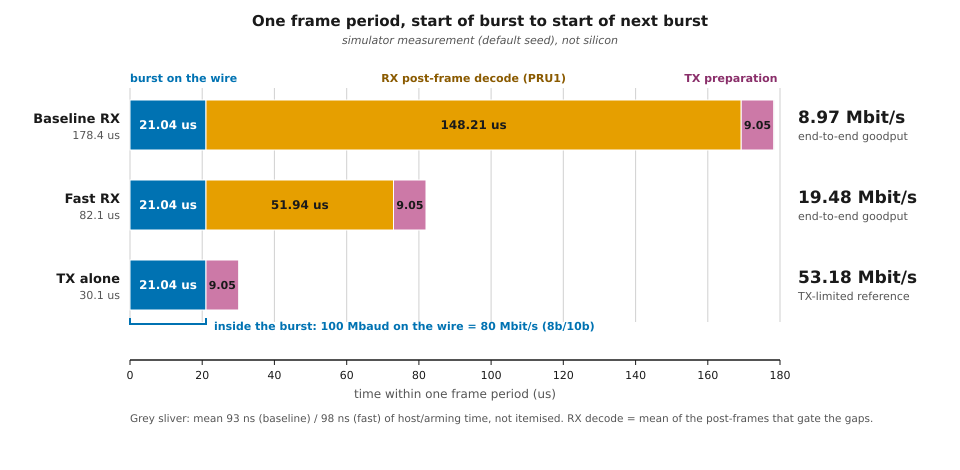

# pif_eth_100 — User's Guide: run the 100 Mbaud TX and RX in the browser UI

PRU0 sends 200-byte 8b/10b BERT frames at 100 Mbaud (300 MHz core, TX divider 3); PRU1
receives them through a loopback wire at 2x oversampling (divider 1.5) and checks CRC-32 and
bit errors against the same PRNG. When a frame is done DRAM1 reads `crc_ok 1`, `symbol_errors 0`,
`bit_err 0`, `tot_bits 1600`. Simulator only, never run on silicon.


*Figure 1. What the two cores do: PRU0 (steps 1 to 5) sends, PRU1 (steps 6 to 10) receives and writes the DRAM1 stats you read in the steps below. Simulator model, not silicon.*

> **How this guide was checked.** UI wording in this guide was derived from the UI source and
> validated by scripted walkthrough over the same HTTP/WebSocket endpoints; a real-browser
> click-through was not performed in the authoring session.

**What goodput to expect.** Inside a burst the wire runs at 100 Mbaud = 80 Mbit/s, but a frame is
only sent after PRU1 has finished decoding the previous one, so the end-to-end goodput is the
payload divided by the whole frame period.



*Figure 2. One frame period for the baseline RX, the fast RX and TX alone (simulator run via `run_100`, not silicon). Regenerate the figures with `python3 source/pif_eth_100/make_figures.py`.*

## Prerequisites

* `pip install -r requirements.txt` (the seed/status client needs `websockets`).
* Run every command from the repo root.

## Steps

1. **Config: 300 MHz on both cores.** The server always loads the repo-root
   `memory.cfg`:
   ```bash
   cp memory.cfg memory.cfg.bak && cp config/memory_pif_eth_100.cfg memory.cfg
   python3 ui/server.py
   ```
   8080 is the server's default port, and the rest of this guide uses it. (The scripted
   walkthrough that validated the guide used a private port, 8091, via
   `python3 ui/server.py --port 8091`.) `memory.cfg` is a tracked file; step 9
   restores it.

   *Alternative for a server that is already running:* pick **300 MHz** in the
   PRU speed dropdown in the controls bar **before doing anything else**. The
   dropdown rewrites `memory.cfg` and rebuilds the simulator, so it drops
   loaded programs, the loopback and all DRAM contents. You will need to
   restore `memory.cfg` yourself afterwards (`git checkout -- memory.cfg`).

2. **Open the UI** at `http://localhost:8080` and confirm the speed dropdown
   in the controls bar reads **300 MHz**.

3. **Multi-core on, partner PRU1.** Click **Multi-core** in the controls bar,
   then choose **PRU1** in the partner dropdown that appears next to it
   (its default is RTU0). Multi-core Run steps PRU0 as the lead and paces PRU1.

4. **Load both programs from the in-UI source browser.**
   Click **Project** (in the Assembly Editor panel title bar) and choose
   `pif_eth_100`. The folder's files open as tabs: `pif_eth_100_rx.asm`,
   `pif_eth_100_rx_fast.asm` (optional, step 4c), `pif_eth_100_tx.asm`,
   `pif_eth_crc32_hw.inc`.
   * Select the `pif_eth_100_tx.asm` tab, set the load-target dropdown in the
     editor title bar (it appears once Multi-core is on) to **→ PRU0**, click
     **Load & Assemble**.
   * Select the `pif_eth_100_rx.asm` tab, set the load target to **→ PRU1**,
     click **Load & Assemble**.

   Warnings:
   * Do not use **Open** → "Browse file system..." (the OS file picker). It
     drops the folder from the file path, and `.include "pif_eth_crc32_hw.inc"`
     then cannot be found. (The **Open** list itself shows only top-level
     `source/` files, not the `pif_eth_100` folder; use **Project**.)
   * Never load the same file into both cores.

   4b. **Click Reset.** In multi-core mode it resets PRU0 and the partner core
   (PC and registers to 0). **Load does not reset a core's PC or registers.**
   Loading `pif_eth_100_rx_fast.asm` over a previously run
   `pif_eth_100_rx.asm` without Reset resumed at the old PC and wrote LUT bytes
   over the stats block (reproduced by the planner; not re-run for this guide).
   Always Reset after loading, then seed.

   4c. **Optional: the optimised receiver.** To run the optimised receiver, load
   `pif_eth_100_rx_fast.asm` into PRU1 instead of `pif_eth_100_rx.asm` (select
   its tab in the **Project** list, load target **-> PRU1**, **Load & Assemble**),
   then **Reset** as in step 4b. Seeding and status are identical (steps 5 to
   8). To switch between the two receivers, load the other file and Reset again.
   The optimised receiver finishes decoding sooner, so a frame is done after
   fewer lead instructions than with the baseline (see the README for figures).

5. **Seed.**
   ```bash
   python3 source/pif_eth_100/seed_ui_100.py
   ```
   Expected output:
   ```
   seeded DRAM0 (TX) + DRAM1 (RX, RXCFG 0x0000801F), loopback ch0 latency 0.8333 ns, frame 1 armed -- click Run
   ```
   This writes PRU0's TX control block and 8b/10b LUT (DRAM0), PRU1's decode
   LUT and control block (DRAM1), zeroes the stats block, enables **loopback
   channel 0 with latency 5/6 ns = 0.8333 ns** (`run_100.LOOPBACK_LATENCY_NS`),
   and arms frame 1 (TX go flag, then RX go flag). The client always talks to
   PRU0's loopback, which is where the UI's loopback lives.

   Where to look: the Loopback card is in the I/O panel's Peripheral Interface
   section, titled "Loopback → PRU1 RX (jitter / latency / drift)", with one
   row per channel (`ch0` checkbox, `lat ns`, `jit ns`, `drift ppm`, **Apply**).
   That section is shown once the firmware has switched the pin mux to the
   Peripheral Interface, so it may only appear after the first Run.
   * Keep the current core PRU0 if you press **Apply**; it applies to the
     current core.
   * The `lat ns` box has a spinner step of 0.5. The server reports
     `0.8333333333333334`; leave the box untouched and Apply keeps that value.
     If you type it, `0.8333` is fine (see "Loopback latency" below).

   (The two points above are from the UI source and the server's state message
   (`io.loopback` was read back as ch0 enabled, latency 0.8333333333333334 ns,
   jitter 0, drift 0). They were not observed in a browser; see Validated.)

6. **Click Run** (PRU0 as the current core). Multi-core Run steps 1000 PRU0
   instructions every 10 ms and paces PRU1; it does not stop by itself. One
   frame needs at most 35 000 PRU0 instructions (the scripted walkthrough
   checks after every 5000 lead instructions and saw `frames` become 1 by the
   35 000-instruction check), so click **Stop**
   after a few seconds, once `status` (step 7) shows `frames 1`. Optionally,
   in the Peripheral panel or a Memory read, check the perif config registers:
   PRU0 TXCFG (`0x260E4`) = `0x00020010`, PRU1 RXCFG (`0x26100`) =
   `0x0000801F`. Both read back exactly these values here.

7. **Check the result.**
   ```bash
   python3 source/pif_eth_100/seed_ui_100.py status
   ```
   Observed (frame 1 complete), exit code 0:
   ```
     frames         1
     cap_bytes      526
     rx_ovf         0
     symbol_errors  0
     crc_ok         1
     bit_err        0
     tot_bits       1600
     eof_status     1
   PASS
   ```
   Or use a Memory panel at `0x2F00` length 64 for the stats and `0x2E00`
   length 204 for the reconstructed frame (200 B payload + 4 B FCS). The payload
   is the xorshift32 stream of the seed, continuing across frames: frame 1
   starts `a521c86ebe053c0c` (golden model `prng_bytes(8, 0x1BADC0DE)`), frame 2
   starts `b0a1abf161f49863`. The second was read back with `read_memory` at
   `0x2E00` after the 2-frame scripted walkthrough on 2026-09-30 (FCS bytes
   `ed97f06d`); the first is the model's value, not read from the UI.

   `status` exits 1 and prints `FAIL (...)` until `frames` reaches 1. While
   RX is still decoding (`post_frame`), an intermediate state (for example
   `frames 0` and `crc_ok 0` with a non-zero `cap_bytes`) is reported as FAIL.
   That is not an error; Run a little longer and query again.

8. **Next frame.** `python3 source/pif_eth_100/seed_ui_100.py arm`, then click
   **Run** again (about the same instruction count). `status` then shows
   `frames 2`, `crc_ok 1`. Each frame needs its own `arm`.

9. **Restore.** Stop the server, then `mv memory.cfg.bak memory.cfg`
   (or `git checkout -- memory.cfg`; then `git status` must not list it).

## DRAM1 (PRU1 RX) addresses

Host (global) addresses; the firmware sees them minus `0x2000`.

| Address | Contents |
|---|---|
| `0x2000` | 8b/10b decode LUT, 1024 x u16 (2048 B) |
| `0x2800` | raw 2x-oversampled capture, 1024 B (about 528 B used; `cap_bytes` 526) |
| `0x2C00` | unused by the baseline RX (the fast RX builds its 256 B decimation LUT here) |
| `0x2E00` | reconstructed frame, 256 B (200 B payload + 4 B FCS) |
| `0x2F00` | stats `frames` (u32) |
| `0x2F04` | stats `cap_bytes` |
| `0x2F08` | stats `rx_ovf` — nonzero = RX FIFO overflowed |
| `0x2F0C` | stats `symbol_errors` — 8b/10b decode failures |
| `0x2F10` | stats `crc_ok` — 1 = FCS matched |
| `0x2F14` | stats `prng_bit_errors` (`bit_err`) |
| `0x2F18` | stats `tot_bits` (= 1600 for a 200 B frame) |
| `0x2F1C` | stats `eof_status` — 1 = clean EOF |
| `0x2F40` | control `mode` (0 = BERT) |
| `0x2F44` | control `seed` (must match PRU0's) |
| `0x2F48` | control `payload_len` (200) |
| `0x2F4C` | control `go` (host arms per frame) |
| `0x2F50` | control `rxcfg` (`0x0000801F`) |

The TX control block is in DRAM0: `0x0400` num_frames, `0x0404` mode, `0x0408`
seed, `0x040C` payload_len, `0x0410` frame count, `0x0414` burst bytes pushed,
`0x0418` go flag.

## Troubleshooting

| Symptom | Cause | Fix |
|---|---|---|
| empty capture, `frames` stays 0 | loopback off, or TX loaded into both cores | re-run `seed`, check which file each core has |
| `crc_ok 0` / `eof_status 0` / garbage | seeded after PRU1 had already run (control block read at boot) | reload PRU1, re-seed, then Run |
| programs vanished | speed dropdown used after loading | set 300 MHz first, then reload |
| stats full of garbage right after Run (e.g. `frames 185272842`) | a core was re-loaded without **Reset** and resumed at its old PC | Reset both cores, re-seed, Run |
| `.include` not found on Load | file opened with the OS file picker | open it from the in-UI **Project** browser |
| `seed_ui_100.py` says "needs 300 MHz" | server is on another clock | step 1 |

The rows above come from the plan and the seed/status client's messages. The
"garbage after Run without Reset" row was reproduced by the planner, not
re-run here. The `frames 0` row (no seed yet) was observed: `status` before
Run, right after seeding, printed all zeros and `FAIL (frames, crc_ok,
tot_bits, eof_status)`, exit 1.

Notes:

* The Signal Graph only traces the lead core (PRU0) during a multi-core Run.
  To watch RX state live, switch the current-core selector to PRU1 (or leave
  multi-core) and read the PRU1 Peripheral Interface channel card (from the UI
  source, not clicked; see the notice at the top).
* **Loopback latency and the known RX limit.** RX decode is not robust when a
  sample lands exactly on a TX edge (0 ns wire delay at one of the three
  sample-to-edge phases): `test_all_edge_phases_clean` at the 10/3 ns shift
  failed with 71 symbol errors at 0 ns wire delay (reproduction command in the
  README "Latency note"). This project's loopback therefore uses 5/6 ns = 0.8333 ns
  (`run_100.LOOPBACK_LATENCY_NS`), which keeps every sample at least 0.83 ns
  from a TX edge. `seed_ui_100.py` sets that value for you. In the UI
  walkthrough the arm phase is fixed by the host's paced stepping, so a
  single-phase UI run does not exercise every phase: with latency set to
  0.0, 0.5, 0.8333, 5/6 and 1.0 ns, one frame each passed clean in this UI flow
  (see Validated). One frame passing in the UI arm phase is not evidence that
  0 ns is robust; keep 0.8333 ns.
  The `lat ns` field has a 0.5 ns spinner step, so the value is not reachable
  by clicking the arrows; leave what `seed` set, or type `0.8333`.

## Validated

Date: 2026-09-30. Simulator only (not silicon). Server on a private port (8091)
with `config/memory_pif_eth_100.cfg` as `memory.cfg`. All four scripted runs below
(base, fast, base, fast) were repeated at 14:16 UTC at commit `6f4b458` with identical
output, and `memory.cfg` was restored byte-identical afterwards.

* **Browser walkthrough not possible in this session** (the Chrome extension
  was not connected: `tabs_context_mcp` reported "Browser extension is not
  connected" on two attempts). The scripted walkthrough over the same
  endpoints is the validation of record. The browser-only wording in this
  guide (button labels, dropdown names, where the Loopback card is, the
  **Project** flow) comes from reading `ui/static/index.html`, `app.js` and
  `server.py`, and the `/source` listing (which returned `pif_eth_100` with
  its four files), not from clicking in a browser.
* **Scripted walkthrough** (`python3 source/pif_eth_100/ui_walkthrough_100.py
  --frames 2 --ws ws://127.0.0.1:8091/ws --http http://127.0.0.1:8091`), exit 0:
  ```
  [step 1-2] UI clock 300 MHz
  [step 4] loaded pif_eth_100_tx.asm -> pru0
  [step 4] loaded pif_eth_100_rx.asm -> pru1
  [step 4b] Reset PRU0 + PRU1 (PC/registers to 0)
  [step 5] seeded DRAM0/DRAM1, loopback ch0 on (latency 0.8333 ns), frame 1 armed
  [step 6-7] frame 1 after 35000 lead instr: {'frames': 1, 'cap_bytes': 526, 'rx_ovf': 0, 'symbol_errors': 0, 'crc_ok': 1, 'bit_err': 0, 'tot_bits': 1600, 'eof_status': 1} -> PASS
  [step 8] armed next frame
  [step 6-7] frame 2 after 35000 lead instr: {'frames': 2, 'cap_bytes': 526, 'rx_ovf': 0, 'symbol_errors': 0, 'crc_ok': 1, 'bit_err': 0, 'tot_bits': 1600, 'eof_status': 1} -> PASS
  UI WALKTHROUGH PASS (2 frames, base RX)
  ```
* **Optimised receiver (step 4c), scripted only.** Same server setup (private
  port 8091, 300 MHz). `ui_walkthrough_100.py --frames 2 --rx fast`, then
  `--rx base`, then `--rx fast` again (each run loads both cores and Resets
  both, so this covers the fast -> base -> fast re-load with Reset), all exit 0.
  Each fast run: frame 1 `frames 1, cap_bytes 526, rx_ovf 0, symbol_errors 0,
  crc_ok 1, bit_err 0, tot_bits 1600, eof_status 1` PASS after 20 000 lead
  instructions, frame 2 the same fields with `frames 2` PASS after a further
  15 000 (the base runs needed 35 000 each). This was validated by script and
  by the `_ui_flow_one_frame("fast")` unit test only; the browser flow for the
  optimised receiver (choosing the fast tab in **Project**, load target,
  **Reset**) was not clicked through in a browser. The four-tab **Project**
  listing is inferred from the server's directory listing, not observed in a
  browser.
* **Seed/status CLI flow (steps 5, 7, 8).** The scripted walkthrough calls the same
  functions as `seed_ui_100.py` (seed, arm, status). A hand-typed CLI session was also
  tried during authoring, but its instruction counts were not saved and are not quoted
  here.
* **Loopback latency probe** (fresh load, Reset and seed each time, latency
  then overridden, 60 000 lead instructions, one frame each): 0.0, 0.5,
  0.8333, 0.8333333333333334 and 1.0 ns all gave `frames 1`, `crc_ok 1`,
  `symbol_errors 0`, `bit_err 0`, `tot_bits 1600`, `eof_status 1`, `rx_ovf 0`.
* Read back from the server after a run: PRU0 TXCFG `0x00020010`, PRU1 RXCFG
  `0x0000801F`, loopback ch0 enabled, latency 0.8333333333333334 ns.
